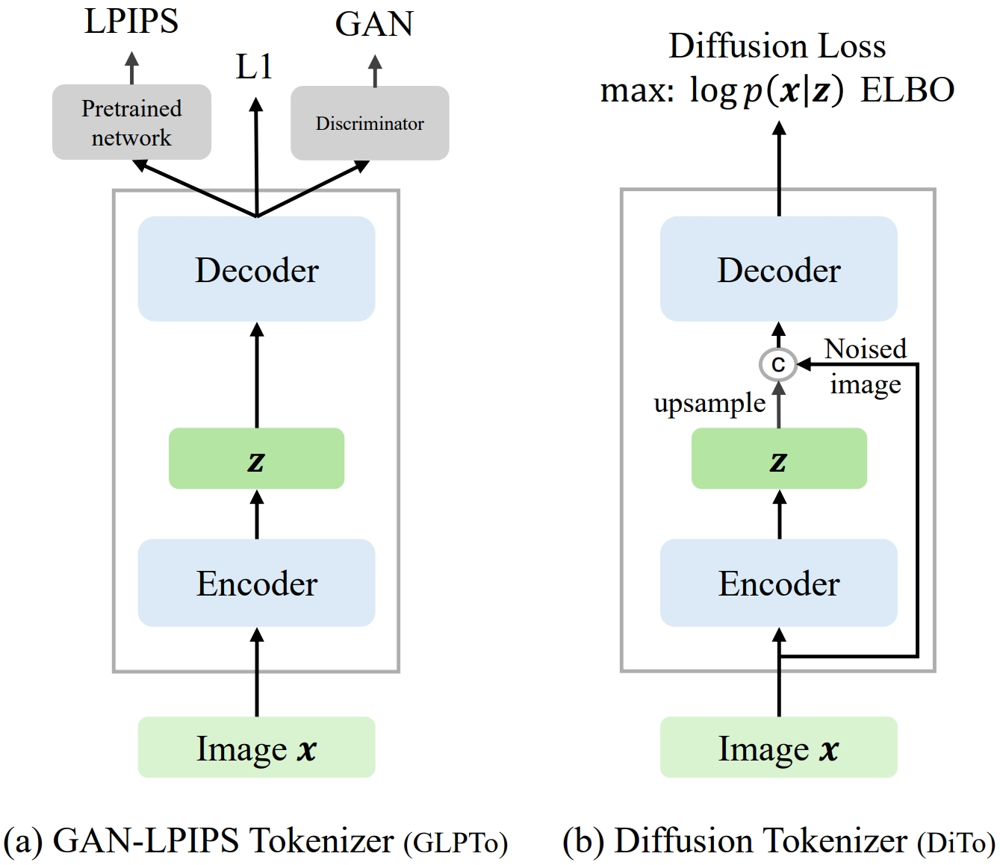

# Diffusion Autoencoders are Scalable Image Tokenizers (DiTo)



## Environment

```.bash
conda create -n dito python=3.11 -y
conda activate dito
pip install -r requirements.txt
```

## Experiments

- By default, the experiment name is the config name. Experiments are saved in `save/` with corresponding names. Append `-n` to manually set a name.

- After filling in the information in `load/wandb.yaml`, append `-w` to log to Wandb.

- Dataset format is image folders. To set up data, fill in `root_path` for configs in `datasets/`. For example, `train` and `val` can be ImageNet training and validation set (as image folders for different classes), `eval_ae`/`eval_zdm` can be a smaller validation subset (image folders, in the paper it is 5K samples in total) that is used to evaluate FID for reconstruction or generation.

- The commands below are for DiTo-XL, the configs can be changed accordingly (in `configs/experiments/`) for other scales or to enable noise synchronization. If the GPU memory is not sufficient, a multi-node training with `torchrun` is needed (or the batch size can be reduced in `configs/datasets/*.yaml`). In the paper, DiTo at B, L, XL were trained on 1, 2, 4 nodes with 8 A100 per node, and latent diffusion models were trained on 2 nodes.

### Train diffusion tokenizers

```.bash
torchrun --nnodes=1 --nproc-per-node=8 run.py --config configs/experiments/dito-XL-f8c4.yaml
```

### Train latent diffusion models

```.bash
torchrun --nnodes=1 --nproc-per-node=8 run.py --config configs/experiments/zdm-XL_dito-XL-f8c4.yaml
```

### Evaluate latent diffusion with 50K samples

```.bash
torchrun --nnodes=1 --nproc-per-node=8 run.py --config configs/experiments/eval50k_zdm-XL_dito-XL-f8c4.yaml --eval-only
```